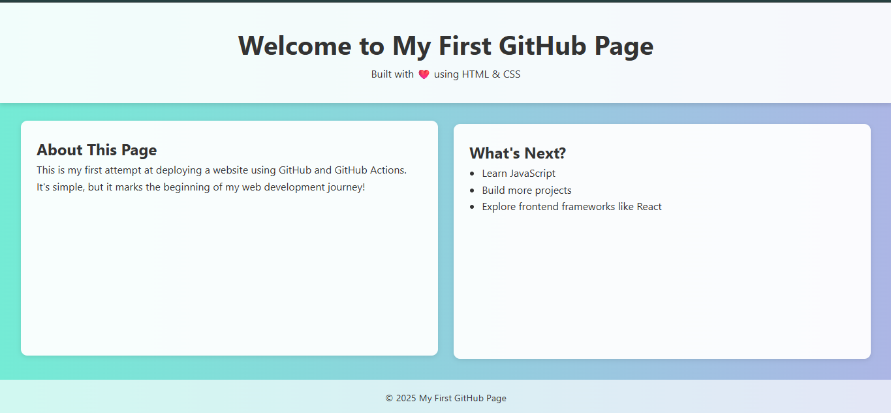

# 🌐 My First GitHub Webpage

Welcome to **My First GitHub Webpage**!  
This is a creative and responsive static site built with HTML and CSS — deployed using **GitHub Pages**. It marks the beginning of my journey into web development, Git, and GitHub Actions 🚀

---

## ✨ Features

- 🌈 Modern, responsive design
- 🎨 Stylish layout with animations and gradient backgrounds
- 💡 Simple structure: `index.html` and `style.css`
- 🚀 Deployed using GitHub Pages

---

## 📁 Project Structure

my-first-github-webpage/ 
├── index.html 
├── style.css 
└── README.md 

---

## 🚀 Deployment

This site is deployed using **GitHub Pages**.  
To deploy your own version:

1. Push this repo to your GitHub account.
2. Go to **Settings > Pages**.
3. Under **Source**, select the branch (e.g., `main`) and folder (`/root` or `/docs` if moved).
4. Save and wait for GitHub to publish your site at:  
   `https://<your-username>.github.io/my-first-github-webpage/`

---

## 🛠️ Built With

- HTML5
- CSS3
- Git & GitHub

---

## 📚 Learning Goals

- Practice using Git and GitHub
- Understand file tracking with `git add`, `git commit`, and `git rm --cached`
- Deploy a simple webpage using GitHub Pages

---

## 📸 Preview

---

## 📬 Contact

Created by **MAQSOOD AHMAD**  
Feel free to fork this repo, open issues, or connect!
